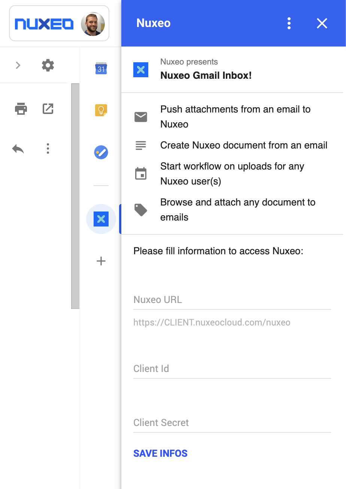
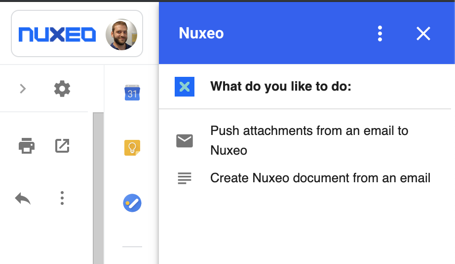
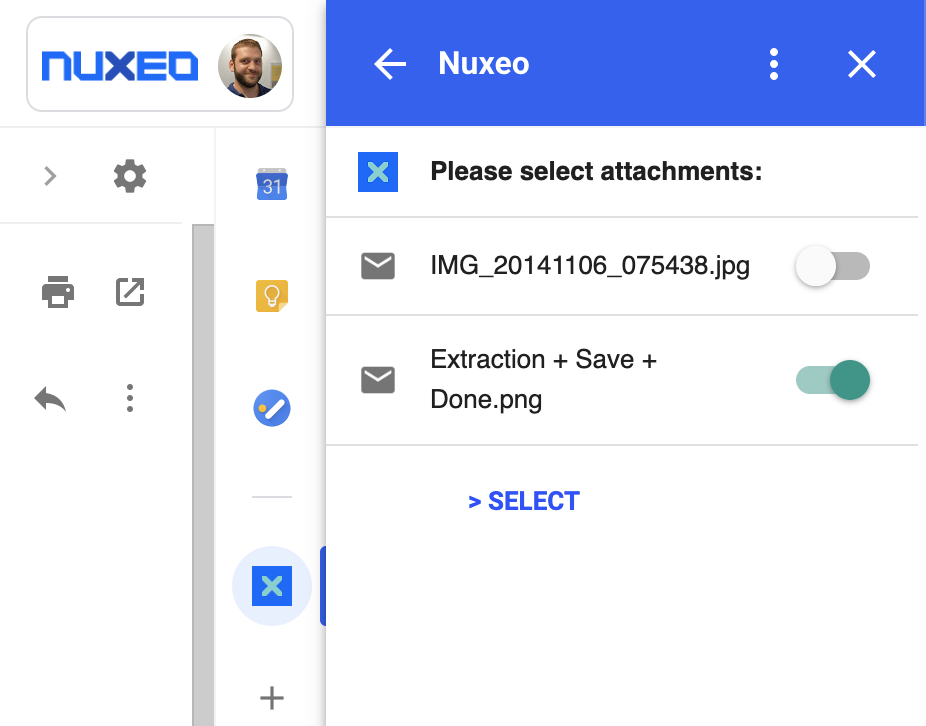
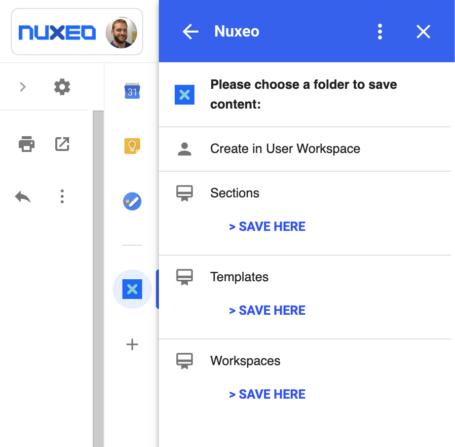

# Nuxeo Gmail Addon

This Nuxeo Gmail Addon lets the Gmail user:

- Push attachments from emails to Nuxeo
- Push email as a document in Nuxeo
- Browse and attach any document to emails
- Execute workflow on uploaded content









## Prerequisites

This addon requires the following:

- [NodeJS](https://nodejs.org/en/download/package-manager/)
  - Tested on node 11.14.0. Doesn't work with node 13.3.0.
- [npm](https://www.npmjs.com/get-npm)
  - Tested on npm 6.9.0
- [gulp](https://gulpjs.com/docs/en/getting-started/quick-start)
  - Tested on gulp 2.0.1
- [clasp](https://github.com/google/clasp#install): `clasp` is a tool for managing Apps Script projects.
  - Tested on clasp 2.3.0
-  A [Nuxeo Server](http://nuxeo.github.io/downloads.html) instance **which can be reachable from Google / Internet**: You can't use a local instance without a public IP.
  - Tested on LTS 2019 (10.10), but should work on LTS 2018 (9.10) and LTS 2017 (8.10)
- [Apps Script API](https://script.google.com/home/usersettings) enabled on your Google profile.

## Installation

### Download the addon sources locally

- Clone the project to your local machine

```
git clone https://github.com/vpasquier/nuxeo-gmail
cd nuxeo-gmail
```

- Initialize the project

```
npm install
```

- Bundle the dependencies

```
npm run build
```

### Deploy the add-on

- Log in Google

```
clasp login
```

- Create a new project and select the **standalone** script

```
clasp create "Nuxeo Gmail"
```

- Push the code

```
clasp push
```

- Tag a version:

```
clasp version 'Push from github'
```

- Deploy the add-on

```
clasp deploy 1 'test'
```

- Verify the deployments

```
clasp deployments
```

Note the deployment ids. There will be two deployments, one for the tagged version, another for the `@HEAD` version.

```
clasp deployments
2 Deployments.
- xxxXXXXXxxxxXXXXXxxxxXXXXXX @HEAD <== Use this one
- xxxXXXXXxxxxXXXXXxxxxXXXXXXxxxXXXXXxxxxXXXXXxxxxXXXXXX @2
```

Use the `@HEAD` deployment when installing the add on if you intend to modify or experiment with the code.


### Get the Nuxeo Addon Script ID

- Open the Google Script console

```
clasp open
```

- Get the script id by clicking on **File > Project properties** and note the value of the **Script ID** field. It will be referenced as `{SCRIPT_ID}` in the next installation steps.

### Create your Github OAuth app

Create a new **OAuth App** in https://github.com/settings/developers
- Application name: `nuxeo-gmail`
- Homepage URL: `https://nuxeo.com`
- Application description: Nuxeo Gmail Addon
- Authorization callback URL (replace the value of the script ID): https://script.google.com/macros/d/`{SCRIPT_ID}`/usercallback


### Configure Nuxeo

- Open your Nuxeo Instance and create a new **OAuth2 Clients**. To do so, we will go to Nuxeo JSF UI: **ADMIN** > **Cloud Services** > **Consumers** > **OAuth2 Clients**
  - Name: Gmail (For this example. Itcan be any value)
  - Client Id: `nuxeo-gmail` (For this example. It can be any value)
  - Client Secret: `secret` (For this example. It can be any value)
  - Redirect URIs: https://script.google.com/macros/d/`{SCRIPT_ID}`/usercallback
  - Auto-grant: Checked
  - Activated: Checked

### Create a script property

- Open the Google Script console

```
clasp open
```

- Click on **File > Project properties > Script properties**.
- Click **Add row**
- Enter the property name `githubCredentials`
- Click on the blank area in the **Value** column.
- Enter the value below, substituting the `{CLIENT_ID}` and `{CLIENT_SECRET}` from your Nuxeo configuration with the values provided `{"clientId": "{CLIENT_ID}", "clientSecret": "{CLIENT_SECRET}" }`
  - For example, `{"clientId": "nuxeo-gmail", "clientSecret": "secret" }`
- Click **Save**

### Install the add-on on Chrome

One the add-on is deployed, install the add-on on your account using these steps:

- Open the **Gmail add-on settings** tab.
- In the **Add-ons** tab, ensure that you have selected the **Enable developer add-ons for my account** checkbox.
- Paste your add-on's deployment ID into the **Install developer add-on** text-box and click **Install**.
- When the addon dialog appears, click the checkbox to indicate that you trust this application, then click **Install**.

The add-on appears in the **Developer add-ons** list at this point. The **Enable debugging information** checkbox (which is checked by default) instructs Gmail to create and display an error report card when script or runtime errors occur during the execution of the add-on.

### Run the add-on

- Open [Gmail](https://mail.google.com/)
  - If Gmail was open prior to enabling the add-on, you may need to refresh the tab.
  - If you don't see the Nuxeo icon, ensure you don't have any other Chrome addon  / them preventing Gmail to display it
- Open a message in Gmail.
- The add-on should place a contextual card on the right-side of the window, with a message asking for authorization.
- Click the **Authorize access** link to open a dialog where you can authorize the add-on.
- Select the account that should authorize the add-on.
- Once authorized, the add-on should automatically refresh and start operating.


## References

- [Google Chrome Extensions - Getting Started Tutorial](https://developers.google.com/gmail/add-ons/guides/quickstart)
- [lodash](https://lodash.com/)
- [moment](http://momentjs.com/)

## Learn

- [Nuxeo Documentation](https://doc.nuxeo.com)
- [Nuxeo University](https://university.nuxeo.com)

## Licensing

[Apache License, Version 2.0](http://www.apache.org/licenses/LICENSE-2.0)

## About Nuxeo

[Nuxeo](www.nuxeo.com), developer of the leading Content Services Platform, is reinventing enterprise content management (ECM) and digital asset management (DAM). Nuxeo is fundamentally changing how people work with data and content to realize new value from digital information. Its cloud-native platform has been deployed by large enterprises, mid-sized businesses and government agencies worldwide. Customers like Verizon, Electronic Arts, ABN Amro, and the Department of Defense have used Nuxeo's technology to transform the way they do business. Founded in 2008, the company is based in New York with offices across the United States, Europe, and Asia.

Learn more at www.nuxeo.com.
